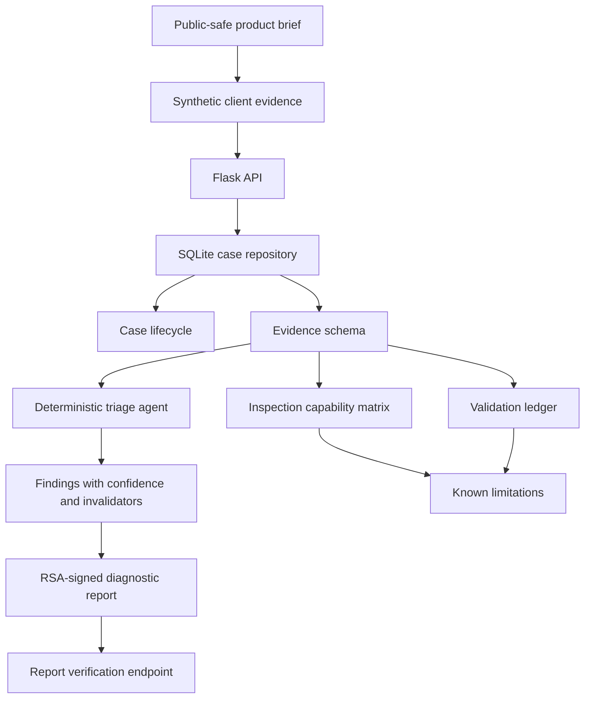

# Portfolio Overview

This document is the fast-read portfolio entry for `device-inspector-demo`.

## One-line value

A public-safe hardware diagnostic and failure-analysis demo that shows how to collect synthetic device evidence, manage case lifecycle, run bounded AI-assisted triage, and generate verifiable reports without exposing real device identifiers or proprietary data.

## What to inspect first

| Area | Why it matters | Entry point |
|---|---|---|
| Product-origin bridge | Shows how a private inspection idea was converted into a public-safe engineering artifact | `docs/origin_bridge.md` |
| Evidence model | Demonstrates provenance, confidence, invalidators, and report contract discipline | `docs/hardware_evidence_schema.md` |
| Inspection capability matrix | Prevents overclaiming by mapping each diagnostic domain to source, confidence, invalidators, and next test | `docs/DEVICE_INSPECTION_MATRIX.md` |
| Validation ledger | Separates verified, partially verified, synthetic-only, blocked, and not-yet-verified claims | `docs/VALIDATION_LOG.md` |
| Known limitations | Documents where the public demo must not claim production-grade capability | `docs/KNOWN_LIMITATIONS.md` |
| Backend API | Demonstrates Flask, SQLite persistence, protected writes, report signing, and verification | `backend/flask_api/` |
| Mobile clients | Shows iOS and Android diagnostic-client skeleton architecture | `clients/` |
| Synthetic CV eval | Shows deterministic synthetic visual-triage evaluation discipline | `ml/` |

## Architecture map

## Demo surfaces

| Surface | What it proves | Current status |
|---|---|---|
| Flask backend | API contract, auth boundary, persistence, report generation, signature verification | Implemented demo baseline |
| Synthetic case examples | Failure-analysis process without real user/device data | Public-safe synthetic data |
| iOS client skeleton | Mobile diagnostic-client architecture | Shell / skeleton level |
| Android client skeleton | Mobile diagnostic-client architecture | Shell / skeleton level |
| Synthetic visual triage lab | Evaluation discipline and metrics artifact pattern | Synthetic-only baseline |
| Documentation set | Professional boundary management and non-overclaiming | Strong portfolio asset |

## Screenshot policy

No real device photos, owner data, production logs, serial identifiers, private diagnostic output, or proprietary procedures should be committed to this public repository.

Portfolio screenshots should be added only when they are generated from synthetic fixtures or redacted demo screens. Until then, the architecture map above is the canonical visual artifact.

## Review narrative

For recruiters or reviewers, this project demonstrates:

- consumer-electronics diagnostic thinking;
- product-safe abstraction from a private product idea;
- backend API design with verification discipline;
- evidence modeling and confidence labeling;
- AI-assisted triage with explicit invalidators;
- cross-platform mobile-client architecture;
- privacy-aware public demo construction;
- GitHub PR-based delivery discipline.
